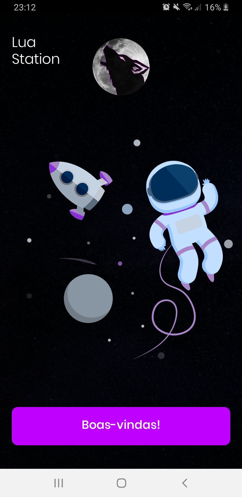
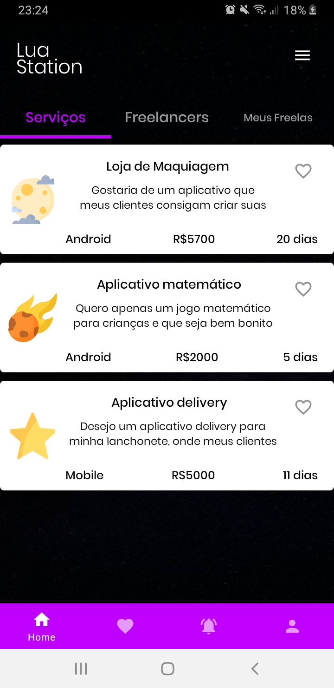
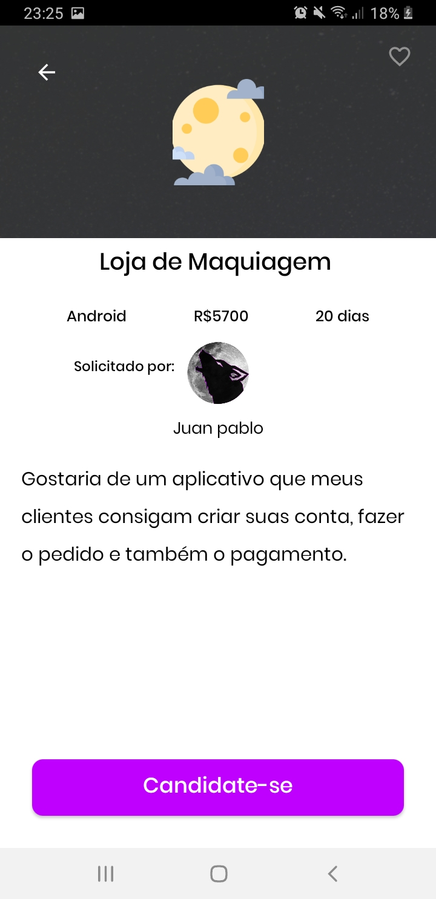
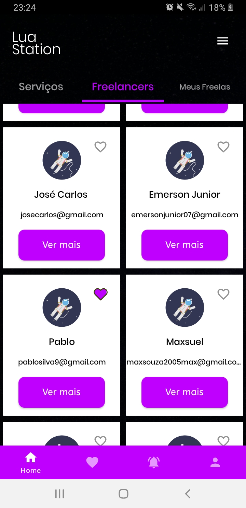
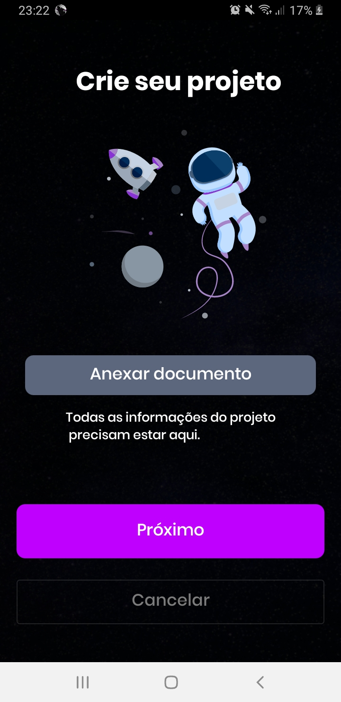

<h1 align="center">Lua Station</h1>

  
  
  

  

⭐ This is a TCC project carried out at ETEC Abdias do Nascimento, which aims to facilitate the entry of social minorities into the technological market as Freelancers. Also it's a way to demonstrate my technical knowledge in native Android development with Kotlin. More technical information below.

 

  
  
  
  
  
  

## Download
Download the <a href="https://www.mediafire.com/file/2sly9mlr2cargr6/luastation.apk/file">APK directly</a>. You can see <a href="https://www.google.com/search?q=como+instalar+um+apk+no+android">here</a> how to install an APK  on your android device.

## Used technologies and open source libraries

- Minimum SDK level 21
- [Language Kotlin](https://kotlinlang.org/)

- Jetpack
  - Lifecycle: Observe Android lifecycles and handle UI states after lifecycle changes.
  - ViewModel: Manages the UI-related data holder and lifecycle. Allows data to survive configuration changes such as screen rotations.
  - ViewBinding: Binds XML components in Kotlin through a class that guarantees type safety and other advantages.
  - Material Design Components: Modular and customizable Material Design UI components for Android.
  - ViewPager2: Show previews or snippets in a slide-out format.
  - Custom Views: Custom views made from scratch using XML.
  
- Libraries
  - [Retrofit2 & OkHttp3](https://github.com/square/retrofit): To perform requests following the HTTP standard.
  - [Picasso](https://github.com/square/picasso): For loading images.
  - [Timber](https://github.com/JakeWharton/timber): For friendlier logging that makes debugging easier.
  - [Lottie](https://github.com/airbnb/lottie-android): For loading animations.
  - [Firebase Database](firebase.google.com/docs/database): To save user data.
  - [Firebase Auth](https://firebase.google.com/docs/auth): To authenticate the user account.
  - [Mockito](https://github.com/mockito/mockito-kotlin): To do unit tests

